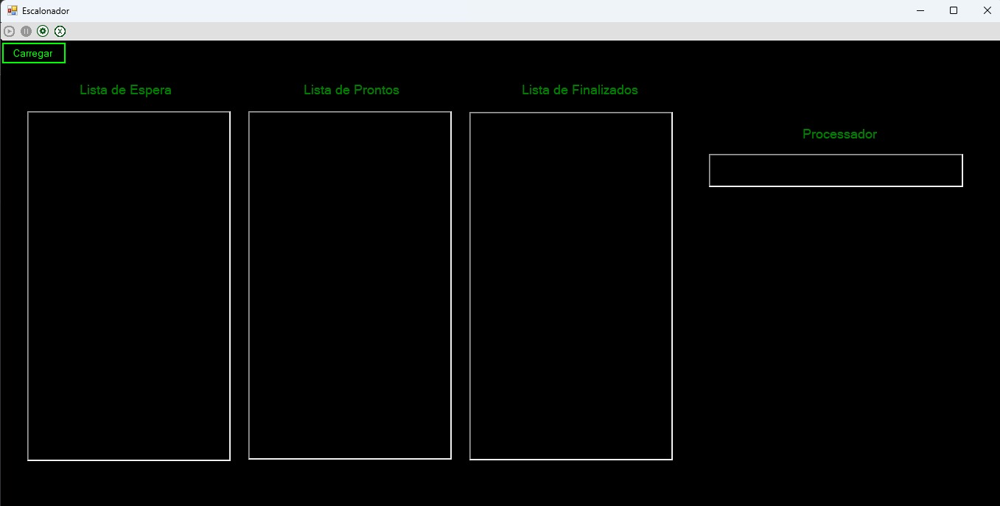
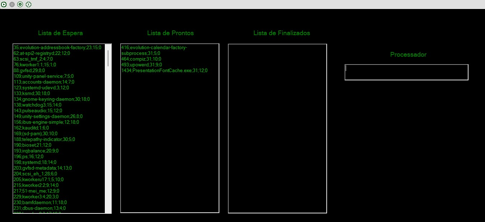
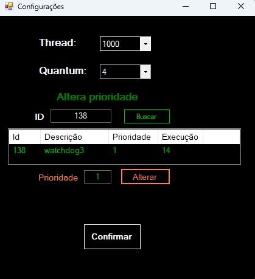
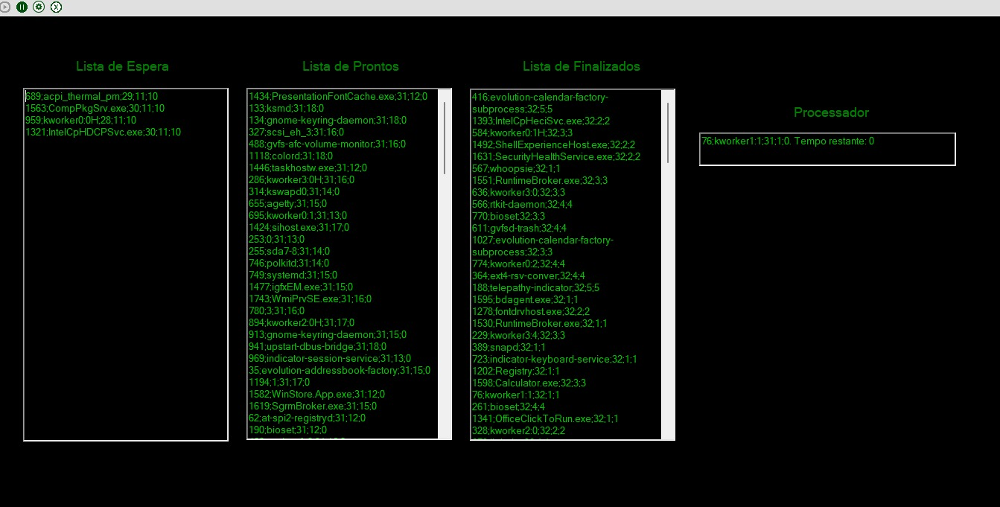

# Escalonador de Processos
Trabalho feito em C# contendo interface Windows Forms para disciplina de Sistemas Operacionais que realiza o escalonamento de processos de acordo com o critério selecionado utilizando threads.

**Aguardando o usuário selecionar a base de dados**

**Dados carregados, aguardando o usuário iniciar o escalonamento:**

**Tela de configuração do escalonamento:**

É possível alterar o tempo do processo e modificar a prioridade de um processo de acordo com a ID em tempo real de execução ou com o escalonamento pausado.

**Escalonamento Iniciado:**

